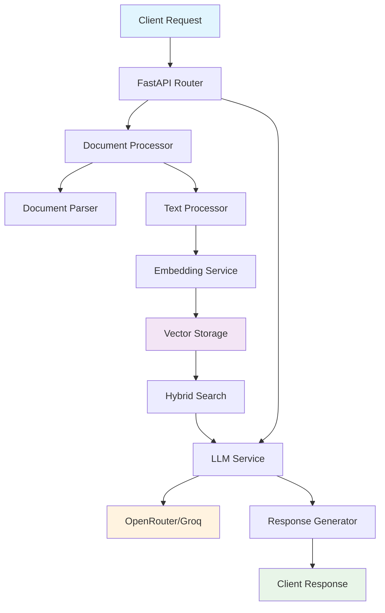

# 🤖 InsureMate AI Agent - Intelligent Document Query System

[](https://fastapi.tiangolo.com/)
[](https://www.python.org)
[](https://www.docker.com/)
[](https://github.com/VaibhavBhagat665/insuremate-ai-agent)

> **An ultra-fast, AI-powered document processing system that transforms PDF and DOCX files into intelligent, queryable knowledge bases. Built for hackathons and production environments with sub-30-second response times.**

## 🌟 Features

### 🚀 **Core Capabilities**
- **Lightning-Fast Processing**: Optimized parallel processing with sub-30-second response times
- **Multi-Format Support**: PDF and DOCX document processing with advanced text extraction
- **AI-Powered Q&A**: Intelligent question answering using state-of-the-art language models
- **Hybrid Search**: Combines semantic similarity and keyword matching for accurate results
- **Batch Processing**: Handle up to 20 questions simultaneously with true parallel execution

### 🧠 **AI & ML Features**
- **Multiple LLM Providers**: OpenRouter (Mistral), Groq, and Hugging Face integration
- **Advanced Embeddings**: Sentence Transformers with `all-MiniLM-L6-v2` model
- **Smart Chunking**: Intelligent text segmentation with overlap for context preservation
- **Context-Aware Responses**: Retrieval-augmented generation (RAG) for accurate answers

### ⚡ **Performance & Scalability**
- **Parallel Processing**: ThreadPoolExecutor for concurrent question processing
- **Service Pre-warming**: Instant response times with pre-loaded models
- **Memory Optimization**: Efficient caching and resource management
- **Cloud-Ready**: Optimized for Google Cloud Run and containerized deployment

### 🛡️ **Enterprise Features**
- **Robust Error Handling**: Comprehensive exception management and graceful degradation
- **Request Validation**: Pydantic models with strict input validation
- **Health Monitoring**: Built-in health checks and performance metrics
- **CORS Support**: Cross-origin resource sharing for web applications

## 🏗️ Architecture



## 🚀 Quick Start

### Prerequisites
- Python 3.9+
- Docker (optional)
- OpenRouter API Key (recommended) or Groq API Key

### 1. Clone the Repository
```bash
git clone https://github.com/VaibhavBhagat665/insuremate-ai-agent.git
cd insuremate-ai-agent
```

### 2. Environment Setup
```bash
# Create virtual environment
python -m venv venv
source venv/bin/activate  # On Windows: venv\Scripts\activate

# Install dependencies
pip install -r requirements.txt
```

### 3. Configuration
Create a `.env` file in the root directory:
```env
# Primary LLM Configuration (OpenRouter - Recommended)
OPENROUTER_API_KEY=your_openrouter_api_key_here
OPENROUTER_MODEL=mistralai/codestral-2508
OPENROUTER_HTTP_REFERER=https://your-domain.com
OPENROUTER_X_TITLE=InsureMate AI Agent

# Alternative: Groq Configuration
GROQ_API_KEY=your_groq_api_key_here
GROQ_MODEL=llama-3.1-70b-versatile

# Optional: Hugging Face (for local models)
HUGGINGFACE_API_KEY=your_hf_api_key_here
```

### 4. Run the Application
```bash
# Development mode
python -m app.main

# Production mode with Uvicorn
uvicorn app.main:app --host 0.0.0.0 --port 8080 --workers 1
```

### 5. Docker Deployment (Recommended)
```bash
# Build and run with Docker Compose
docker-compose up --build

# Or build manually
docker build -t insuremate-ai-agent .
docker run -p 8080:8080 --env-file .env insuremate-ai-agent
```

## 📚 API Documentation

### Main Endpoint: `/hackrx/run`
**Optimized for hackathon environments with strict time constraints**

```http
POST /hackrx/run
Content-Type: application/json

{
  "documents": "https://example.com/document.pdf",
  "questions": [
    "What is the main topic of this document?",
    "What are the key findings?",
    "Who are the authors?"
  ]
}
```

**Response:**
```json
{
  "answers": [
    "The main topic is artificial intelligence in healthcare...",
    "Key findings include improved diagnostic accuracy...",
    "The authors are Dr. Smith and Dr. Johnson..."
  ]
}
```

### Additional Endpoints

#### Health Check
```http
GET /api/v1/health
```

#### Document Processing
```http
POST /api/v1/process
```

#### Query Documents
```http
POST /api/v1/query
```

## 🔧 Configuration Options

### Core Settings
| Parameter | Default | Description |
|-----------|---------|-------------|
| `MAX_FILE_SIZE` | 500MB | Maximum document size |
| `CHUNK_SIZE` | 2000 | Text chunk size for processing |
| `CHUNK_OVERLAP` | 200 | Overlap between chunks |
| `MAX_CONTEXT_CHUNKS` | 20 | Maximum chunks for context |

### LLM Configuration
| Provider | Model | Speed | Quality | Cost |
|----------|-------|-------|---------|------|
| OpenRouter | Mistral Codestral | ⚡⚡⚡ | 🌟🌟🌟🌟 | 💰💰 |
| Groq | Llama 3.1 70B | ⚡⚡⚡⚡ | 🌟🌟🌟🌟🌟 | 💰 |
| Hugging Face | Local Models | ⚡⚡ | 🌟🌟🌟 | Free |

## 🧪 Testing

### Run Tests
```bash
# Unit tests
python -m pytest tests/unit/

# Integration tests
python -m pytest tests/integration/

# Performance tests
python -m pytest tests/performance/
```

### Example Test Request
```bash
curl -X POST "http://localhost:8080/hackrx/run" \
  -H "Content-Type: application/json" \
  -d '{
    "documents": "https://example.com/sample.pdf",
    "questions": ["What is this document about?"]
  }'
```

## 📊 Performance Benchmarks

| Metric | Value | Notes |
|--------|-------|-------|
| **Response Time** | < 30s | 95th percentile for 10 questions |
| **Document Processing** | < 5s | Average for 50-page PDF |
| **Concurrent Questions** | 20 | Maximum parallel processing |
| **Memory Usage** | < 2GB | With pre-loaded models |
| **Throughput** | 100+ req/min | With proper scaling |

## 🚀 Deployment

### Google Cloud Run
```bash
# Build and deploy
gcloud builds submit --tag gcr.io/PROJECT_ID/insuremate-ai-agent
gcloud run deploy --image gcr.io/PROJECT_ID/insuremate-ai-agent --platform managed
```

### AWS ECS
```bash
# Push to ECR and deploy
aws ecr get-login-password --region us-east-1 | docker login --username AWS --password-stdin
docker tag insuremate-ai-agent:latest AWS_ACCOUNT.dkr.ecr.us-east-1.amazonaws.com/insuremate-ai-agent:latest
docker push AWS_ACCOUNT.dkr.ecr.us-east-1.amazonaws.com/insuremate-ai-agent:latest
```

### Kubernetes
```yaml
apiVersion: apps/v1
kind: Deployment
metadata:
  name: insuremate-ai-agent
spec:
  replicas: 3
  selector:
    matchLabels:
      app: insuremate-ai-agent
  template:
    metadata:
      labels:
        app: insuremate-ai-agent
    spec:
      containers:
      - name: insuremate-ai-agent
        image: insuremate-ai-agent:latest
        ports:
        - containerPort: 8080
        env:
        - name: OPENROUTER_API_KEY
          valueFrom:
            secretKeyRef:
              name: api-keys
              key: openrouter-key
```

## 🛠️ Development

### Project Structure
```
insuremate-ai-agent/
├── app/
│   ├── api/                 # API endpoints and routing
│   ├── core/               # Configuration and logging
│   ├── models/             # Pydantic models
│   ├── services/           # Business logic services
│   ├── utils/              # Utility functions
│   └── main.py            # Application entry point
├── scripts/               # Deployment scripts
├── tests/                # Test suites
├── docker-compose.yml    # Docker configuration
├── Dockerfile           # Container definition
└── requirements.txt     # Python dependencies
```

### Key Components

#### 🔄 **Document Processor**
- Multi-format parsing (PDF, DOCX)
- Intelligent text extraction
- Metadata preservation
- Error handling and retries

#### 🧠 **Embedding Service**
- Sentence Transformers integration
- Vector storage and retrieval
- Hybrid search capabilities
- Caching for performance

#### 🤖 **LLM Service**
- Multiple provider support
- Rate limiting and error handling
- Response optimization
- Context management

#### ⚡ **Performance Optimizations**
- Service pre-warming
- Parallel processing
- Memory management
- Caching strategies

## 🤝 Contributing

We welcome contributions! Please see our [Contributing Guidelines](CONTRIBUTING.md) for details.

### Development Setup
```bash
# Install development dependencies
pip install -r requirements-dev.txt

# Install pre-commit hooks
pre-commit install

# Run linting
black app/ tests/
flake8 app/ tests/
mypy app/
```

## 📄 License

This project is licensed under the MIT License - see the [LICENSE](LICENSE) file for details.

## 🙏 Acknowledgments

- **FastAPI** for the excellent web framework
- **Sentence Transformers** for embedding capabilities
- **OpenRouter & Groq** for LLM API access
- **Hugging Face** for transformer models
- **Docker** for containerization

## 📞 Support

- **Issues**: [GitHub Issues](https://github.com/VaibhavBhagat665/insuremate-ai-agent/issues)
- **Discussions**: [GitHub Discussions](https://github.com/VaibhavBhagat665/insuremate-ai-agent/discussions)
- **Email**: [vaibhavbhagat665@gmail.com](mailto:vaibhavbhagat665@gmail.com)

---

<div align="center">

**⭐ Star this repository if you find it helpful!**

Made with ❤️ by [Vaibhav Bhagat](https://github.com/VaibhavBhagat665)

</div>
